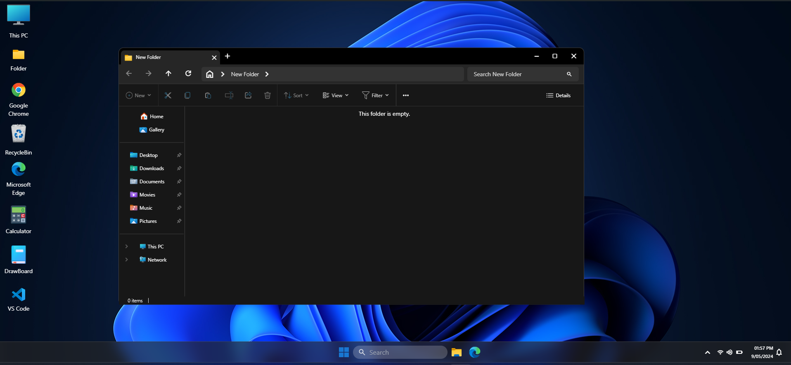
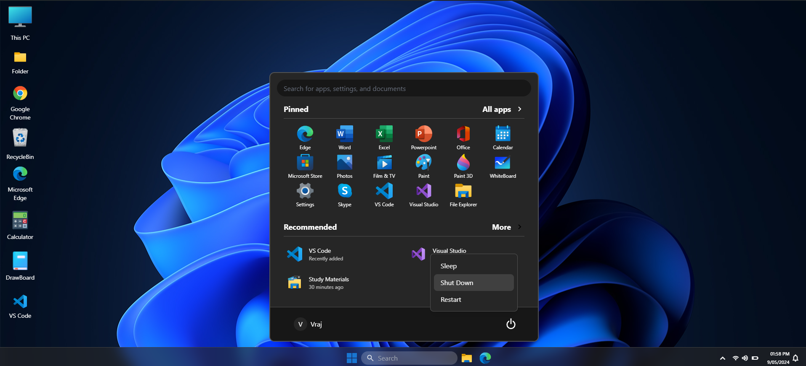

### Windows 11 Clone in React

**This project is for learning purposes only.**

### Live Link: [Live Demo](https://react-windows-11.onrender.com)

This React project mimics the Windows 11 desktop experience with fully functional draggable windows using only JavaScript and Framer Motion for smooth animations, no external draggable libraries.

### Tech Stack:
- **React.js**
- **Tailwind CSS**
- **Framer Motion** (for smooth animations)

### Features:
- **Apps:**
  - This PC
  - Folder
  - Google Chrome
  - Recycle Bin
  - Microsoft Edge
  - Calculator
  - DrawBoard
  - VS Code

- **Working Components:**
  - Fully functional **Windows Start Menu** with search, shutdown, and restart functionality.
  - **Login page** resembling Windows 11.
  - Custom **draggable windows** for smooth interaction.
  - **Right-click context menu** with multiple options.
  - Fully interactive **terminal** with basic command support.

### Screenshots:








### Not Mobile supported yet* 


## Contributing

1. **Fork the Repository:** Click on "Fork" at the top right of this GitHub page.
2. **Clone the Repository:**
   ```bash
   git clone https://github.com/VrajVyas11/React_Windows_11.git
   ```
3. **Navigate to the Project Directory:**
   ```bash
   cd React_Windows_11
   ```
4. **Install Dependencies:**
   ```bash
   npm install
   ```
5. **Start the Development Server:**
   ```bash
   npm start
   ```
